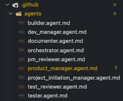
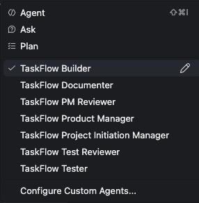
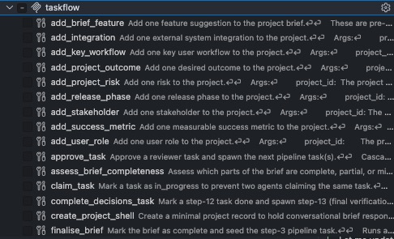
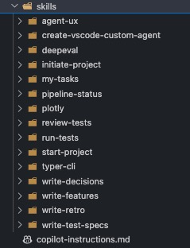
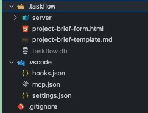

# TaskFlow

**A structured, database-driven development pipeline for VS Code + GitHub Copilot and Claude Code.**

TaskFlow gives your AI agents a shared memory, a defined process, and clear roles. Instead of one agent doing everything in one long chat, each development activity is handled by a specialist agent, at the right step, with the right context, and only when the previous step is approved.

Clone this repo into any project. VS Code and Claude Code both wire up the MCP server, agents, and skills automatically. The SQLite database is the single source of truth: it records every decision, tracks every task, and gives each agent exactly the context it needs, nothing more.



---

## Contents

### About TaskFlow

[Task-Driven Architecture](#task-driven-architecture)
[Review Gates](#review-gates)
[Agents, Roles, and Tools](#agents-roles-and-tools)
[Other Key Features](#other-key-features)
[Why TaskFlow?](#why-taskflow)

### Setup

[Prerequisites](#prerequisites)
[Setup for VS Code](#setup-for-vs-code)
[Setup for Claude Code](#setup-for-claude-code)

### Usage

[Using TaskFlow](#using-taskflow)
[The 13-step pipeline](#the-13-step-pipeline)
[Agents](#agents)
[Slash commands](#slash-commands)
[Project brief form](#project-brief-form-whats-captured)

### Reference info

[Pipeline diagram](#pipeline-diagram)
[Project layout](#project-layout)
[Schema reference](#schema-reference)
[Unblocking a stuck task](#unblocking-a-stuck-task)

---

## Task-Driven Architecture

TaskFlow is built around a single principle: **no agent acts without a task record authorising it.**

Every step in the pipeline, defining features, writing tests, building, reviewing, documenting, is represented as a row in the `tasks` table. An agent can only write output for a step if it holds a valid claim on that task. Once it submits, the task advances; the next agent in the sequence picks up from the database, not from the chat.

This design solves the two most common failure modes of Copilot agents:

- **Stale, over-broad context:** each agent calls `read_task_context` and receives a scoped payload (brief, feature, prior outputs) assembled for that step only. Agents have no direct access to workspace files unless the step explicitly requires it (the Builder is the only agent that does).
- **No audit trail:** every decision, approval, retro, and test result is written to the database, not buried in chat history. You can query the full decision record at any point with standard SQL.

The result is an architecture where agents are tightly scoped, independently verifiable, and safe to run autonomously, because the database enforces what each agent is allowed to do and see.

***

## Review Gates

TaskFlow applies a dedicated reviewer agent to every major output before the pipeline can advance. There are three distinct review gates:

- **PM Reviewer** approves the feature set (step 4) before any build work begins, and performs final verification against success metrics at step 13.
- **Test Reviewer** approves test specs (step 6) before the Builder is authorised to implement, meaning the Builder always works to pre-approved acceptance criteria, not its own interpretation.
- **PM Reviewer** (again) approves the decisions written in response to retrospective recommendations (step 11) before they are formalised as decision artefacts.

No reviewer agent generates output, they only read and approve or reject. This separation ensures that the agent producing work is never the agent judging it.

***

## Agents, Roles, and Tools

| Agent | Pipeline Steps | Responsibilities | Key Tools / DB Writes |
|---|---|---|---|
| **Project Initiation Manager** | Pre-pipeline | Creates project brief conversationally or ingests a brief JSON file | `ingest_brief`, `askQuestions` |
| **Dev Manager** | Pre-pipeline | Queries MCP registry, recommends integrations, edits `mcp.json` | `record_team_setup`, MCP registry query |
| **Orchestrator** | 3–13 | Runs the full pipeline autonomously; retries on failure; escalates only when genuinely blocked | Pipeline state read, step invocation |
| **Product Manager** | 3, 10, 12 | Defines features + definitions of done; writes decisions on retro recommendations; formalises decision artefacts | `features`, `definitions_of_done`, `decisions`, `decision_artefacts` |
| **PM Reviewer** | 2, 4, 11, 13 | Approves scope, feature set, decisions, and final success-metric verification; spawns per-feature tasks at step 4 | `approve/reject task`, feature task spawn |
| **Tester** | 5, 8 | Writes test specs per feature; executes tests against the build | `test_specs`, `test_results` |
| **Test Reviewer** | 6 | Approves test specs before any build work is authorised | `approve/reject test_specs` |
| **Builder** | 7 | Implements features against approved test specs; the only agent with direct workspace file access | `build_reports`, workspace writes |
| **Documenter** | 9 | Writes feature retrospective and seeds recommendations for the PM | `retro_reports`, `recommendations` |

***

## Other Key Features

### Zero manual install

VS Code detects `.vscode/mcp.json` on startup and launches the MCP server via `uv` automatically. There are no `pip install` steps and no server to manage manually.

### Works on new or existing projects

Clone the repo fresh, or copy four directories into an existing workspace root. The pipeline starts from wherever your project is now.

### The brief is the shared context

Every agent draws from the same structured brief stored in the database, not from re-reading files or chat history. The offline HTML form captures identity, goals, features, user workflows, NFRs, integrations, risks, and release phases, and the `ingest_brief` tool parses it all into the schema in one step.

### Autonomous by default, manual when you want

The Orchestrator runs the entire pipeline hands-off. But every step can also be invoked directly, `/my-tasks` shows what's pending for any agent role, and you can work the pipeline manually at any granularity.

### Retry logic and unblocking are built in

If a task fails three times it becomes `blocked` and the Orchestrator escalates with options. You can also reset or force-advance tasks directly with two SQL statements, no tooling required.

### The pipeline cycles

Steps 5–13 repeat per feature. New-feature recommendations that emerge from retrospectives (step 9) feed back into step 3 as the next cycle's backlog, so the pipeline handles ongoing development, not just initial delivery

---

## Why TaskFlow?

Without structure, AI-assisted development tends to collapse into a single long conversation. The context grows stale, the agent loses track of what was approved, and there's no audit trail when something goes wrong.

TaskFlow solves this by treating development like a proper process:

- **Brief → plan → build → test → document:** in order, not all at once
- Every agent action is gated by a task record. An agent can only submit work for a step if it holds a valid claim on that task.
- Decisions, retros, and test results are stored in the database, not buried in chat history.
- **The Orchestrator runs the whole thing automatically, escalating to you only when something is genuinely blocked.**

---

## Prerequisites

- [uv](https://docs.astral.sh/uv/getting-started/installation/), `brew install uv` or `curl -LsSf https://astral.sh/uv/install.sh | sh`
- VS Code 1.99+ with GitHub Copilot (agent mode enabled) **or** Claude Code

> **Agent mode** is the VS Code Copilot feature that lets you @-mention specialist agents in chat. Enable it in Settings → GitHub Copilot → Chat: Agent Mode.

<!-- screenshot: VS Code settings panel showing Chat Agent Mode enabled -->

---

## Setup for VS Code

### 1. Clone into your project

If you are starting a new project from scratch:

```bash
git clone https://github.com/pedrogrande/open-taskflow.git my-project
cd my-project
```

If you want to add TaskFlow to an **existing** project, copy the following into your workspace root:

```
.github/
.taskflow/
.vscode/mcp.json
.vscode/settings.json
.vscode/hooks.json   # merge with your existing hooks if you have one
.gitignore           # add the .taskflow/ entries to your existing .gitignore
```

### 2. Open the workspace in VS Code

VS Code detects `.vscode/mcp.json` on startup and launches the TaskFlow MCP server automatically via `uv`. On first run `uv` downloads the single `mcp` dependency, no manual `pip install` required.

You'll see **taskflow** listed under **Configure Tools** (the gear icon in the Copilot chat input bar). That confirms the MCP server is running and tools are available.






### 3. Add `.taskflow/` to your `.gitignore`

The database and audit log are runtime files, don't commit them:

```
.taskflow/taskflow.db
.taskflow/audit.log
.taskflow/server/__pycache__/
```

These are already in the `.gitignore` included with this repo. If you merged into an existing project, add these lines manually.

---

## Setup for Claude Code

### 1. Clone into your project

Same as VS Code setup — clone the repo or copy directories into an existing project root.

### 2. Open in Claude Code

```bash
claude .
```

Claude Code detects `.mcp.json` on startup and connects to the TaskFlow MCP server automatically. Confirm by running `/mcp` to list active MCP servers — you should see `taskflow` listed.

### 3. Copy files to add to an existing project

```
.claude/
.taskflow/
.mcp.json
CLAUDE.md
.gitignore   # add the .taskflow/ entries to your existing .gitignore
```

---

## Using TaskFlow

TaskFlow has three phases: **Initiate**, **Configure**, and **Run**.

There is an orchestrator agent that manages all phases from project initiation through to completion.

The Orchestrator invokes each specialist agent in order, re-reads pipeline state after each step to confirm advancement, and handles retries automatically. It escalates to you with a clear question only when a task is genuinely blocked.

However, if you would like to use it manually to begin with, you can follow these steps.

### [Step 1] Initiate: build the project brief

The project brief is the foundation. All agents draw context from it throughout the pipeline. There are two ways to create one.

#### Option A: Project brief form (recommended)

Open `.taskflow/project-brief-form.html` in any browser, it runs fully offline.

<!-- screenshot: project-brief-form.html open in a browser, showing the Features section -->

Complete all sections: identity, goals, features, workflows, NFRs, integrations, risks, and timeline. Click **Generate brief** — a `project-brief-<name>.json` file downloads. Then use the slash command in VS Code Copilot chat:

```
/start-project
```

The skill will ask for the file path or let you paste the contents. It calls `ingest_brief`, which parses all structured data into the database and seeds the first pipeline task.

#### Option B: Conversational brief

Skip the form and use the slash command:

```
/start-project
```

The skill asks whether you have a brief file or want to enter text directly. The TaskFlow Project Initiation Manager then guides you through the brief one question at a time, recording each answer to the database as you go.

<!-- screenshot: VS Code Copilot chat showing the Project Initiation Manager asking a question with the askQuestions UI -->

---

### [Step 2] Configure: set up the agent team (recommended)

Once the brief is ingested, use the slash command:

```
/setup-team
```

The Dev Manager reads your brief, extracts your tech stack and integrations, queries the [official MCP server registry](https://registry.modelcontextprotocol.io) for relevant servers, and presents a consolidated summary for your approval before making any changes.

<!-- screenshot: VS Code Copilot chat showing Dev Manager askQuestions panel with MCP server recommendations -->

Skip this phase if your project has no specific integrations or if you want to start building immediately, the pipeline works without it.

---

### [Step 3] Run: the pipeline

Start the full pipeline with the slash command:

```
/run-pipeline
```

The Orchestrator picks up the project, shows you a pre-pipeline summary of the approved features and team setup, asks for your approval, then works through steps 3–13 one feature at a time. It prints a status line after each step and escalates to you only when a task is genuinely blocked.

<!-- screenshot: VS Code Copilot chat showing the Orchestrator reporting step completions and a pipeline summary -->

You can also use `/my-tasks` at any point to see what's pending for a specific agent role and invoke that agent directly.

---

## The 13-step pipeline

| Step | Agent | Activity |
|---|---|---|
| 1 | Project Initiation Manager | Brief ingested, project created |
| 2 | PM Reviewer | Approves project scope |
| 3 | Product Manager | Defines features + definitions of done |
| 4 | PM Reviewer | Approves feature set, spawns per-feature tasks |
| 5 | Tester | Writes test specs per feature |
| 6 | Test Reviewer | Approves test specs |
| 7 | Builder | Implements the feature |
| 8 | Tester | Runs tests against the build |
| 9 | Documenter | Writes retrospective + recommendations |
| 10 | Product Manager | Writes decisions on recommendations |
| 11 | PM Reviewer | Approves decisions |
| 12 | Product Manager | Writes decision artefacts (patterns, gotchas, notes) |
| 13 | PM Reviewer | Final verification against success metrics |

Steps 5–13 repeat per feature. New-feature decisions from step 9 feed back to step 3 as the next cycle's backlog.

---

## Agents

| Agent | Role |
|---|---|
| **TaskFlow Project Initiation Manager** | Creates the project brief conversationally or ingests a brief JSON (pre-pipeline) |
| **TaskFlow Dev Manager** | Configures the agent team for your specific tech stack (pre-pipeline) |
| **TaskFlow Orchestrator** | Runs steps 3–13 autonomously, the default way to work the pipeline |
| **TaskFlow Product Manager** | Defines features, decisions, and decision artefacts (steps 3, 10, 12) |
| **TaskFlow PM Reviewer** | Reviews and approves PM outputs (steps 2, 4, 11, 13) |
| **TaskFlow Tester** | Writes test specs and runs tests (steps 5, 8) |
| **TaskFlow Test Reviewer** | Reviews test specs (step 6) |
| **TaskFlow Builder** | Implements features (step 7) |
| **TaskFlow Documenter** | Writes retrospective and recommendations (step 9) |

<!-- screenshot: VS Code Copilot chat showing the @-mention agent picker with all TaskFlow agents listed -->

---

## Slash commands

Type `/` in Copilot chat to see all available commands.

| Command | What it does |
|---|---|
| `/start-project` | Start a project — accepts a brief file path or inline text |
| `/setup-team` | Configure the agent team for your tech stack (Dev Manager) |
| `/run-pipeline` | Run the full pipeline autonomously (Orchestrator) |
| `/my-tasks` | Show pending tasks for a chosen agent role |
| `/pipeline-status` | Show the full pipeline state for a project |

---

## Project brief form, what's captured

The form (`.taskflow/project-brief-form.html`) is a single offline HTML file, no install, no server, no dependencies. It auto-saves to `localStorage` every 2 seconds.

| Section | What agents use it for |
|---|---|
| Project identity & problem | All agents, scope and context |
| Goals & success metrics | PM (feature alignment); PM Reviewer (step 13 final verification) |
| User roles & workflows | PM (user-centric features); Tester (test scenario design) |
| Features (Must / Should / Could) | PM (step 3 starting point, Must features promoted first) |
| Non-functional requirements | Builder (implementation constraints); Tester (verification) |
| Integrations | Dev Manager (MCP server research); Builder (system, auth method, phase flag) |
| Risks | PM (seeded as initial decision artefacts in steps 10/12) |
| Release phases | PM (assigns features to cycles) |
| Timeline & deadline | All reviewers, prioritisation context |

---

## Pipeline diagram

```
Phase 1: Initiate
  Brief form → project-brief.json → ingest_brief
    OR
  @TaskFlow Project Initiation Manager (conversational)
        │
        ▼
Phase 2: Configure (recommended)
  @TaskFlow Dev Manager
    Reads brief → queries MCP registry → enriches agent team
        │
        ▼
Phase 3: Run
  @TaskFlow Orchestrator
    Steps 3–13 autonomously
        │
        ├─ Step 3:  PM defines features + DoD
        ├─ Step 4:  PM Reviewer approves → spawns per-feature tasks
        │
        │  (per feature)
        ├─ Step 5:  Tester writes test specs
        ├─ Step 6:  Test Reviewer approves
        ├─ Step 7:  Builder implements
        ├─ Step 8:  Tester runs tests ──(fail × 3 → blocked → you decide)
        │
        ├─ Step 9:  Documenter writes retro
        ├─ Step 10: PM writes decisions
        ├─ Step 11: PM Reviewer approves
        ├─ Step 12: PM writes decision artefacts
        └─ Step 13: PM Reviewer final verification
                │
                └──► Step 3 (next cycle, new features from backlog)
```

---

## Project layout

```
open-taskflow/
  .github/
    agents/                          # 9 agent .agent.md files (VS Code)
    skills/                          # Skill directories (shared)
    copilot-instructions.md          # Agent routing + tool reference (VS Code)
  .claude/
    agents/                          # 9 subagent .md files (Claude Code)
    skills -> ../.github/skills      # Symlink — same skills, both clients
    settings.json                    # PostToolUse audit hook (Claude Code)
  .taskflow/
    server/
      mcp_server.py                  # FastMCP server (all tools)
      init.sql                       # Schema + pipeline seed data
    project-brief-form.html          # Offline brief form
    project-brief-template.md        # Reference template
    taskflow.db                      # Runtime DB (gitignored, auto-created)
    audit.log                        # Tool call audit trail (gitignored)
  .vscode/
    mcp.json                         # Workspace MCP server definition (VS Code)
    settings.json                    # Skills + hooks locations (VS Code)
    hooks.json                       # SessionStart + PostToolUse hooks (VS Code)
  .mcp.json                          # MCP server definition (Claude Code)
  CLAUDE.md                          # Agent routing + tool reference (Claude Code)
  .gitignore
  README.md
```

---

## Schema reference

**Pipeline tables** (written by agents during the cycle):

| Table | Purpose |
|---|---|
| `projects` | Project records with scalar brief fields + raw JSON |
| `features` | Feature records per project |
| `definitions_of_done` | Verifiable DoD criteria per feature |
| `test_specs` | Test specifications per feature |
| `build_reports` | Build output per feature per cycle |
| `test_results` | Pass/fail per test spec per build |
| `retro_reports` | Retrospective summaries per feature |
| `recommendations` | Recommendations from retros |
| `decisions` | Decisions made on recommendations |
| `decision_artefacts` | Patterns, gotchas, notes from step 12 |
| `feature_backlog` | New features queued for future cycles |
| `tasks` | Pipeline task queue (the engine) |
| `pipeline_steps` | 13-step workflow definition (seed data) |
| `team_setup` | Agent team configuration recorded by Dev Manager |

**Brief-derived tables** (populated by `ingest_brief` from the form JSON):

| Table | Purpose |
|---|---|
| `project_outcomes` | Stated goals |
| `success_metrics` | Measurable targets for step-13 verification |
| `user_roles` | Actor descriptions and primary workflows |
| `stakeholders` | Named stakeholders and authority |
| `key_workflows` | Actor → trigger → steps → outcome journeys |
| `non_functional_requirements` | Enabled NFR constraints only |
| `integrations` | External systems with direction, auth method, phase flag |
| `project_risks` | Risks with likelihood/impact/mitigation |
| `release_phases` | Phase-by-phase scope and target dates |
| `brief_features` | Feature suggestions from the form (PM refines at step 3) |

All brief-derived tables are returned by `read_task_context` via the `brief` key, agents never re-read the original JSON file.

---

## Unblocking a stuck task

If a task hits `retry_count = 3` it becomes `blocked`. The Orchestrator will escalate to you with options. If you need to reset it manually:

```sql
-- Reset for another attempt
UPDATE tasks SET retry_count = 0, status = 'pending' WHERE id = <task_id>;

-- Or force-advance past a stuck step
UPDATE tasks SET status = 'done' WHERE id = <task_id>;
```

Then use `/pipeline-status` to confirm the updated state.
